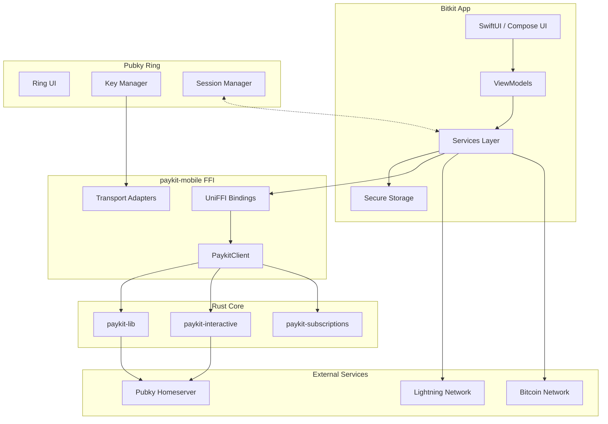
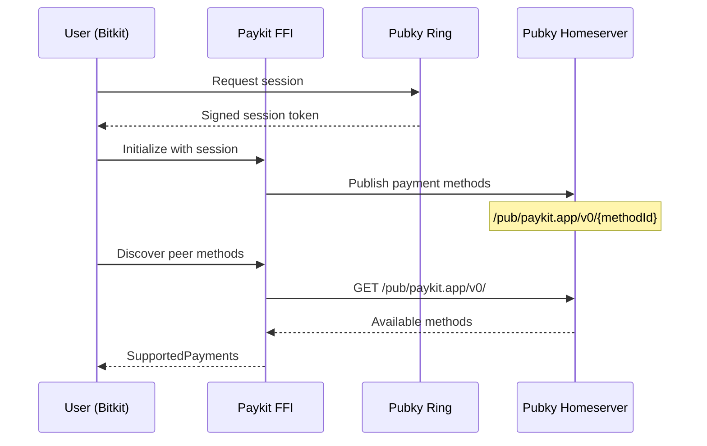

# Bitkit + Paykit Integration Master Guide

> **For Synonym Development Team**  
> **Version**: 1.1  
> **Last Updated**: December 23, 2025  
> **Status**: Reference Implementation - Production Verification Required

This guide documents the complete integration of Paykit into Bitkit iOS, Bitkit Android, and Pubky Ring. It serves as a detailed map for production developers to follow, including all steps, quirks, stubs, and future work.

**Implementation Status**:
- Core architecture and features implemented
- Security hardening applied (Phases 1-4)
- Documentation accurate to current code state
- End-to-end verification required before production deployment

---

## Table of Contents

1. [Executive Summary](#1-executive-summary)
2. [Architecture Overview](#2-architecture-overview)
3. [Prerequisites](#3-prerequisites)
4. [Building paykit-rs](#4-building-paykit-rs)
   - [4.5 Building pubky-noise](#45-building-pubky-noise-required-for-noise-payments)
5. [iOS Integration](#5-ios-integration)
6. [Android Integration](#6-android-integration)
7. [Pubky Ring Integration](#7-pubky-ring-integration)
   - [7.1 Native Module Architecture](#71-native-module-architecture-pubky-noise-in-ring)
   - [7.2 Paykit Connect Action](#72-paykit-connect-action-ring-side-implementation)
   - [7.3 Bitkit-side Session and Key Handling](#73-bitkit-side-session-and-key-handling)
8. [Feature Implementation Guide](#8-feature-implementation-guide)
9. [Known Quirks & Footguns](#9-known-quirks--footguns)
10. [Stubs & Mocks Inventory](#10-stubs--mocks-inventory)
11. [Testing Requirements](#11-testing-requirements)
12. [Production Configuration](#12-production-configuration)
13. [Security Checklist](#13-security-checklist)
14. [Troubleshooting](#14-troubleshooting)
15. [Future Work](#15-future-work)
16. [Production Implementation Checklist](#16-production-implementation-checklist)
17. [Architectural Hardening](#17-architectural-hardening) ⭐ NEW

**Related Documents**:
- 📘 [PHASE_1-4_IMPROVEMENTS.md](PHASE_1-4_IMPROVEMENTS.md) - Detailed implementation summary
- 🔒 [SECURITY_ARCHITECTURE.md](SECURITY_ARCHITECTURE.md) - Security model and threat analysis
- 🔔 [PUSH_RELAY_DESIGN.md](PUSH_RELAY_DESIGN.md) - Push relay service specification

---

## 1. Executive Summary

### What is Paykit?

Paykit is a decentralized payment protocol built on Pubky that enables:
- **Payment Method Discovery**: Query public directories to find how someone accepts payments
- **Encrypted Payment Channels**: Noise Protocol (Noise_IK) for secure payment negotiation
- **Multi-Method Support**: Bitcoin onchain, Lightning, and extensible to other methods
- **Subscriptions & Auto-Pay**: Recurring payments with cryptographic agreements

### What This Integration Accomplishes

| Feature | iOS | Android | Ring |
|---------|-----|---------|------|
| Payment Method Discovery | ✅ | ✅ | ✅ |
| Directory Publishing | ✅ | ✅ | ✅ |
| Noise Protocol Payments | ✅ | ✅ | N/A |
| Subscriptions | ✅ | ✅ | N/A |
| Auto-Pay Rules | ✅ | ✅ | N/A |
| Spending Limits | ✅ | ✅ | N/A |
| Smart Checkout | ⚠️ Not integrated (Bitkit) | ⚠️ Not integrated (Bitkit) | N/A |
| Cross-App Key Sharing | ✅ | ✅ | ✅ |

### Current Status

| Component | Status | Notes |
|-----------|--------|-------|
| `paykit-lib` | ✅ Production-Ready | Core protocol library |
| `paykit-interactive` | ✅ Production-Ready | Noise payments |
| `paykit-subscriptions` | ✅ Production-Ready | Recurring payments |
| `paykit-mobile` | ✅ Production-Ready | FFI bindings |
| Bitkit iOS Integration | ⚠️ Verification Required | Core features + security hardening complete |
| Bitkit Android Integration | ⚠️ Verification Required | Core features + security hardening complete |
| Ring Integration | ⚠️ Verification Required | Secure handoff + signing implemented |

### Pre-Production Verification Checklist

Before deploying to production, verify end-to-end:
- [ ] Secure handoff flow works (no secrets in URLs)
- [ ] iOS push relay Ed25519 signing completes successfully
- [ ] Android push relay Ed25519 signing completes successfully
- [ ] Key rotation from epoch 0 to epoch 1 succeeds
- [ ] Cache miss recovery auto-requests from Ring
- [ ] Cross-device authentication via QR works
- [ ] All deep link callbacks handled correctly
- [ ] Session persistence survives app restart
- [ ] Type-safe HomeserverURL prevents pubkey/URL confusion

### Review Lens (for architecture + assumptions)

This section is meant to help the Bitkit dev team review the project at a high level (challenge assumptions, validate decisions, and spot missing production wiring) before diving into implementation details.

#### What to read first (recommended order)

1. **This Section 1. Executive Summary** (what exists + what still needs verification)
2. **Section 17. Architectural Hardening** (Phases 1–4: security + reliability changes)
3. **[SECURITY_ARCHITECTURE.md](SECURITY_ARCHITECTURE.md)** (threat model, attack surface, security properties)
4. **[PUSH_RELAY_DESIGN.md](PUSH_RELAY_DESIGN.md)** (push relay API + auth model)
5. **Section 16. Production Implementation Checklist** (what production must wire up)

#### Key architectural decisions (with tradeoffs)

| Decision | What we did | Tradeoff / what to challenge |
|---|---|---|
| Ring-only identity | Ed25519 master secret never leaves Ring; Bitkit consumes sessions + derived X25519 keys | Requires Ring installation (or cross-device flow) for initial provisioning and for signing requests |
| Secure handoff | Ring writes handoff JSON at an unguessable homeserver path; Bitkit fetches via `request_id` | Payload is **not encrypted at rest**; security relies on unguessability + TTL + TLS + deletion after fetch |
| Push relay vs public directory tokens | Push tokens are registered to a relay; wake requests require Ed25519 signatures | Adds backend dependency; requires careful lifecycle wiring for token rotation + session replacement |
| Type-safe identifiers | Introduced `HomeserverURL`, `HomeserverPubkey`, `OwnerPubkey`, `SessionSecret` | Requires discipline to avoid reintroducing raw strings at boundaries |
| Key rotation model | Epoch-based X25519 keypairs (epoch 0 + epoch 1) cached locally; rotation is manual-triggered | No automatic cadence; requires product decision on rotation triggers and migration path |

#### Invariants (things the system assumes are true)

- **No secrets in callback URLs** for paykit setup (secure handoff only)
- **Sessions authenticate via cookie**: `Cookie: session=<sessionSecret>` on authenticated homeserver requests
- **Ring is the only signer**: Ed25519 signatures used for push relay auth are produced by Ring
- **Handoff lifecycle**: short TTL + Bitkit deletes after fetch (defense-in-depth)

#### Review prompts (what to scrutinize)

- **Security**:
  - Are we comfortable with “public read + unguessable path” for handoff payloads, or do we require at-rest encryption / authenticated read?
  - Are callback schemes and deep link handlers hardened against spoofing and confused-deputy issues?
  - Are we leaking any secrets via logs, analytics, crash reports, or OS-level deep link telemetry?
- **Reliability**:
  - What is the expected behavior when Ring is unavailable, the relay is unavailable, or the homeserver is slow/unreachable?
  - Do session expiry/refresh paths cover all real session types we rely on?
  - Do background workers/tasks align with iOS/Android OS constraints for wake + polling?
- **Maintainability**:
  - Are boundaries clear (`UI → ViewModel → Repository/Service → FFI/SDK`) and consistent across both platforms?
  - Are we duplicating HTTP/signing/session logic in multiple services that should be consolidated (see Future Work)?
- **Product/UX**:
  - What user-facing flows exist when signing is required (Ring prompts), and are those flows acceptable?
  - What is the plan for user education and failure recovery (Ring not installed, revoked capabilities, etc.)?

---

## 2. Architecture Overview

### Component Diagram



### Key Architecture: "Cold Pkarr, Hot Noise"

This architecture separates key responsibilities:

| Key Type | Purpose | Storage | Rotation |
|----------|---------|---------|----------|
| **Ed25519 (pkarr)** | Identity, signatures | Ring (cold) | Rarely |
| **X25519 (noise)** | Session encryption | Bitkit (hot) | Per-session |

**Flow:**
1. Ring holds the master Ed25519 identity key ("cold")
2. Bitkit derives X25519 session keys via HKDF ("hot")
3. Noise channels use X25519 for encryption
4. Signatures for subscriptions use Ed25519 from Ring

### Data Flow: Payment Discovery



---

## 3. Prerequisites

### Development Environment

| Tool | Required Version | Purpose |
|------|------------------|---------|
| Rust | 1.70+ (via Rustup, NOT Homebrew) | Build paykit-rs |
| UniFFI | 0.25+ | Generate FFI bindings |
| Xcode | 14+ | iOS build |
| Swift | 5.5+ | iOS bindings |
| Android Studio | Latest | Android build |
| Kotlin | 1.8+ | Android bindings |
| Android NDK | r25+ | Native library compilation |

### ⚠️ CRITICAL: Rust Installation

**DO NOT use Homebrew Rust.** WASM targets and cross-compilation require Rustup.

```bash
# If you have Homebrew Rust, remove it first
brew uninstall rust

# Install Rustup
curl --proto '=https' --tlsv1.2 -sSf https://sh.rustup.rs | sh

# Add targets
rustup target add aarch64-apple-ios
rustup target add aarch64-apple-ios-sim
rustup target add x86_64-apple-ios
rustup target add aarch64-linux-android
rustup target add armv7-linux-androideabi
rustup target add i686-linux-android
rustup target add x86_64-linux-android
rustup target add wasm32-unknown-unknown
```

### Repository Setup

Clone all required repositories (use your internal remotes/forks as appropriate):

```bash
mkdir -p ~/vibes-dev && cd ~/vibes-dev

# Core Paykit
git clone https://github.com/synonymdev/paykit-rs.git

# Mobile apps
git clone https://github.com/synonymdev/bitkit-ios.git
git clone https://github.com/synonymdev/bitkit-android.git

# Pubky ecosystem
git clone https://github.com/pubky/pubky-ring.git
git clone https://github.com/pubky/pubky-noise.git
git clone https://github.com/pubky/pubky-core.git
```

---

## 4. Building paykit-rs

### Step 1: Build the Core Library

```bash
cd ~/vibes-dev/paykit-rs

# Build release for current platform
cargo build --release -p paykit-mobile

# Verify build artifacts
ls -la target/release/libpaykit_mobile.*
# Should see: libpaykit_mobile.dylib (macOS) or .so (Linux)
```

### Step 2: Generate FFI Bindings

```bash
# Install uniffi-bindgen if not installed (must match the UniFFI version in paykit-mobile)
cargo install uniffi-bindgen-cli@0.25

# Generate bindings using the repo script (preferred)
cd paykit-mobile
./generate-bindings.sh

# Outputs (host platform):
# - paykit-mobile/swift/generated/PaykitMobile.swift + PaykitMobileFFI.h + PaykitMobileFFI.modulemap
# - paykit-mobile/kotlin/generated/paykit_mobile.kt
```

### Step 3: Build for iOS (All Architectures)

```bash
cd paykit-mobile

# Build and create an XCFramework (this is what Bitkit iOS consumes)
./build-ios.sh --framework

# Outputs:
# - paykit-mobile/ios-demo/PaykitDemo/PaykitDemo/Frameworks/PaykitMobile.xcframework
# - headers/modulemap inside the XCFramework from paykit-mobile/swift/generated/
```

### Step 3.1: Copy XCFramework into Bitkit iOS

```bash
# Copy PaykitMobile.xcframework into Bitkit iOS integration frameworks directory
cp -R \
  ../paykit-mobile/ios-demo/PaykitDemo/PaykitDemo/Frameworks/PaykitMobile.xcframework \
  ../../bitkit-ios/Bitkit/PaykitIntegration/Frameworks/
```

Bitkit iOS currently treats this as an interim approach (copied binary). See:
- `bitkit-ios/Bitkit/PaykitIntegration/Frameworks/FRAMEWORKS_README.md`

### Step 4: Build for Android (All ABIs)

```bash
# Set NDK path
export ANDROID_NDK_HOME=$HOME/Library/Android/sdk/ndk/25.2.9519653

# Run the Android build script
./build-android.sh

# This creates libraries for each ABI:
# - jniLibs/arm64-v8a/libpaykit_mobile.so
# - jniLibs/armeabi-v7a/libpaykit_mobile.so
# - jniLibs/x86/libpaykit_mobile.so
# - jniLibs/x86_64/libpaykit_mobile.so
```

---

## 4.5 Building pubky-noise (Required for Noise Payments)

Bitkit and Ring both require `pubky-noise` for encrypted channels. **pubky-noise is a separate repository** from paykit-rs.

### Step 1: Build for iOS

```bash
cd ~/vibes-dev/pubky-noise

# Build XCFramework (device + simulator)
./build-ios.sh

# Outputs:
# - platforms/ios/PubkyNoise.xcframework/
# - generated-swift/PubkyNoise.swift (UniFFI bindings)
# - generated-swift/PubkyNoiseFFI.h + .modulemap
```

### Step 2: Build for Android

```bash
cd ~/vibes-dev/pubky-noise

# Ensure NDK is set
export ANDROID_NDK_HOME=$HOME/Library/Android/sdk/ndk/25.2.9519653

./build-android.sh

# Outputs:
# - platforms/android/src/main/jniLibs/arm64-v8a/libpubky_noise.so
# - platforms/android/src/main/jniLibs/x86_64/libpubky_noise.so
# - generated-kotlin/com/pubky/noise/pubky_noise.kt
```

### Step 3: Copy to Target Projects

**For Bitkit iOS:**
```bash
cp -R pubky-noise/platforms/ios/PubkyNoise.xcframework \
      bitkit-ios/Bitkit/PaykitIntegration/Frameworks/

cp pubky-noise/generated-swift/PubkyNoise.swift \
   bitkit-ios/Bitkit/PaykitIntegration/FFI/
```

**For Bitkit Android:**
```bash
cp pubky-noise/platforms/android/src/main/jniLibs/arm64-v8a/libpubky_noise.so \
   bitkit-android/app/src/main/jniLibs/arm64-v8a/

cp pubky-noise/platforms/android/src/main/jniLibs/x86_64/libpubky_noise.so \
   bitkit-android/app/src/main/jniLibs/x86_64/

cp pubky-noise/generated-kotlin/com/pubky/noise/pubky_noise.kt \
   bitkit-android/app/src/main/java/com/pubky/noise/
```

**For Pubky Ring iOS:**
```bash
cp -R pubky-noise/platforms/ios/PubkyNoise.xcframework \
      pubky-ring/ios/

cp pubky-noise/generated-swift/PubkyNoise.swift \
   pubky-ring/ios/pubkyring/
```

**For Pubky Ring Android:**
```bash
cp pubky-noise/platforms/android/src/main/jniLibs/arm64-v8a/libpubky_noise.so \
   pubky-ring/android/app/src/main/jniLibs/arm64-v8a/

cp pubky-noise/generated-kotlin/com/pubky/noise/pubky_noise.kt \
   pubky-ring/android/app/src/main/java/com/pubky/noise/
```

### pubky-noise Version Compatibility

| Component | Minimum Version | Notes |
|-----------|-----------------|-------|
| pubky-noise | 1.0.0+ | Has `deriveDeviceKey` throwing variant |
| Bitkit iOS | Swift 5.5+ | Uses XCFramework |
| Bitkit Android | Kotlin 1.8+ | Uses JNI .so |
| Ring iOS | Swift 5.5+ | Uses XCFramework via CocoaPods |
| Ring Android | Kotlin 1.8+ | Uses JNI .so |

**Key API (pubky-noise 1.0+):**

```rust
// From pubky-noise Rust API (what UniFFI exposes)
pub fn derive_device_key(
    seed: &[u8],      // 32-byte Ed25519 seed
    device_id: &[u8], // Arbitrary device identifier
    epoch: u32        // Rotation epoch (0, 1, 2...)
) -> Result<[u8; 32], NoiseError>;

pub fn public_key_from_secret(secret: &[u8]) -> [u8; 32];
```

---

## 5. iOS Integration

### Step 1: Add Framework to Xcode

1. **Copy files to project:**
   ```
   Bitkit/
   └── PaykitIntegration/
       ├── FFI/
       │   ├── PaykitMobile.swift           # Generated UniFFI Swift bindings
       │   ├── PaykitMobileFFI.h            # UniFFI-generated C header
       │   └── PaykitMobileFFI.modulemap    # Module map used by the XCFramework
       ├── Frameworks/
       │   ├── PaykitMobile.xcframework     # From paykit-rs/paykit-mobile (build-ios.sh --framework)
       │   └── PubkyNoise.xcframework       # From pubky-noise (iOS build script)
       └── Services/
           ├── PaykitManager.swift
           ├── DirectoryService.swift
           └── NoisePaymentService.swift
   ```

2. **Configure Xcode project:**
   - Add `Bitkit/PaykitIntegration/Frameworks/PaykitMobile.xcframework` to the project.
   - Ensure the XCFramework is linked in the Bitkit target under:
     - **General** → **Frameworks, Libraries, and Embedded Content**
   - Do not manually add `-lpaykit_mobile` when using the XCFramework approach.
   - Keep the UniFFI generated Swift file in the app target (Bitkit imports PaykitMobile types through `Bitkit/PaykitIntegration/FFI/PaykitMobile.swift`).

### Step 2: Initialize PaykitManager

```swift
// This is the real Bitkit integration pattern:
// - Initialize PaykitClient with the correct network
// - Restore Pubky sessions from Keychain
// - Configure Pubky SDK
// - Register Bitcoin + Lightning executors so Paykit can execute payments
//
// Reference implementation:
// - bitkit-ios/Bitkit/PaykitIntegration/PaykitManager.swift
// - bitkit-ios/Bitkit/PaykitIntegration/PaykitIntegrationHelper.swift

do {
    try PaykitManager.shared.initialize()
    try PaykitManager.shared.registerExecutors()
} catch {
    Logger.error("Paykit setup failed: \(error)", context: "Paykit")
}
```

### Step 3: Implement Transport Callbacks

Bitkit does not implement a bespoke URLSession “transport callback” in the app layer. Instead it uses the UniFFI callback-based transports directly, wired through `DirectoryService`:

- `bitkit-ios/Bitkit/PaykitIntegration/Services/DirectoryService.swift`
- `bitkit-ios/Bitkit/PaykitIntegration/Services/PubkyStorageAdapter.swift`

The real pattern is:

1. Create a `PubkyUnauthenticatedStorageAdapter` (read-only) and wrap it:
   - `UnauthenticatedTransportFfi.fromCallback(callback: adapter)`
2. Create a `PubkyAuthenticatedStorageAdapter` (write) and wrap it:
   - `AuthenticatedTransportFfi.fromCallback(callback: adapter, ownerPubkey: <pubkey>)`
3. Pass these transports into Paykit directory operations.

In Bitkit iOS, the session secret is transported as a cookie header: `Cookie: session=<sessionSecret>`.

### Step 4: Register Deep Links

In `Info.plist`, add URL schemes:

```xml
<key>CFBundleURLTypes</key>
<array>
    <dict>
        <key>CFBundleURLSchemes</key>
        <array>
            <string>bitkit</string>
            <string>paykit</string>
        </array>
    </dict>
</array>
```

Handle in the Bitkit deep link layer. The reference implementation handles **payment request deep links** in `bitkit-ios/Bitkit/MainNavView.swift`.

Supported formats:
- `paykit://payment-request?requestId=<request-id>&from=<sender-pubkey>`
- `bitkit://payment-request?requestId=<request-id>&from=<sender-pubkey>`

The publish-side creates a deep link like:
- `bitkit://payment-request?requestId=<request-id>&from=<our-pubkey>`

Important: Bitkit currently uses **payment requests + autopay evaluation**. Do not assume a “smart checkout” URI like `paykit://<pubkey>/pay?amount=<amount-sats>&memo=<memo>` exists in Bitkit.

```swift
// Reference implementation: bitkit-ios/Bitkit/MainNavView.swift
// Supported formats:
// - paykit://payment-request?requestId=<request-id>&from=<sender-pubkey>
// - bitkit://payment-request?requestId=<request-id>&from=<sender-pubkey>

private func handleIncomingURL(_ url: URL) {
    if url.scheme == "paykit" || (url.scheme == "bitkit" && url.host == "payment-request") {
        Task {
            await handlePaymentRequestDeepLink(url: url)
        }
        return
    }

    // Handle other Bitkit deep links (bitcoin:, lightning:, lnurl*, internal routes)
}

private func handlePaymentRequestDeepLink(url: URL) async {
    guard
        let components = URLComponents(url: url, resolvingAgainstBaseURL: false),
        let queryItems = components.queryItems,
        let requestId = queryItems.first(where: { $0.name == "requestId" })?.value,
        let fromPubkey = queryItems.first(where: { $0.name == "from" })?.value
    else {
        // Show error to user: invalid deep link
        return
    }

    // Validate Pubky sender pubkey (z-base-32, 52 chars)
    if !isValidZBase32Pubkey(fromPubkey) {
        // Show error to user: invalid sender pubkey
        return
    }

    // Ensure Paykit is ready (this can fail if Ring isn't connected)
    if !PaykitManager.shared.isInitialized {
        do {
            try PaykitManager.shared.initialize()
            try PaykitManager.shared.registerExecutors()
        } catch {
            // “Please connect to Pubky Ring first”
            return
        }
    }

    guard let paykitClient = PaykitManager.shared.client else { return }

    // Policy: autopay evaluation lives in app code
    let autoPayViewModel = await AutoPayViewModel()

    let paymentRequestService = PaymentRequestService(
        paykitClient: paykitClient,
        autopayEvaluator: autoPayViewModel,
        paymentRequestStorage: PaymentRequestStorage(),
        directoryService: DirectoryService.shared
    )

    paymentRequestService.handleIncomingRequest(requestId: requestId, fromPubkey: fromPubkey) { result in
        Task { @MainActor in
            // Handle:
            // - autoPaid(paymentResult)
            // - needsApproval(request)
            // - denied(reason)
            // - error(error)
        }
    }
}

private func isValidZBase32Pubkey(_ pubkey: String) -> Bool {
    // z-base-32 encoded Ed25519 keys are 52 characters
    // Valid charset: ybndrfg8ejkmcpqxot1uwisza345h769
    let validCharset = CharacterSet(charactersIn: "ybndrfg8ejkmcpqxot1uwisza345h769")
    return pubkey.count == 52 && pubkey.rangeOfCharacter(from: validCharset.inverted) == nil
}
```

### Step 5: Implement Keychain Storage

```swift
// PaykitKeychainStorage.swift
import Security

class PaykitKeychainStorage {
    private let service = "to.bitkit.paykit"
    
    func save(key: String, data: Data) throws {
        let query: [String: Any] = [
            kSecClass as String: kSecClassGenericPassword,
            kSecAttrService as String: service,
            kSecAttrAccount as String: key,
            kSecValueData as String: data,
            kSecAttrAccessible as String: kSecAttrAccessibleAfterFirstUnlock
        ]
        
        SecItemDelete(query as CFDictionary)
        let status = SecItemAdd(query as CFDictionary, nil)
        guard status == errSecSuccess else {
            throw KeychainError.saveFailed(status)
        }
    }
    
    func load(key: String) throws -> Data? {
        let query: [String: Any] = [
            kSecClass as String: kSecClassGenericPassword,
            kSecAttrService as String: service,
            kSecAttrAccount as String: key,
            kSecReturnData as String: true
        ]
        
        var result: AnyObject?
        let status = SecItemCopyMatching(query as CFDictionary, &result)
        
        if status == errSecItemNotFound { return nil }
        guard status == errSecSuccess else {
            throw KeychainError.loadFailed(status)
        }
        return result as? Data
    }
}
```

---

## 6. Android Integration

### Step 1: Add JNI Libraries

1. **Copy SO files:**
   ```
   app/src/main/jniLibs/
   ├── arm64-v8a/
   │   └── libpaykit_mobile.so
   ├── armeabi-v7a/
   │   └── libpaykit_mobile.so
   ├── x86/
   │   └── libpaykit_mobile.so
   └── x86_64/
       └── libpaykit_mobile.so
   ```

2. **Copy Kotlin bindings:**
   ```
   app/src/main/java/uniffi/paykit_mobile/
   └── paykit_mobile.kt
   ```

### Step 2: Configure Gradle

```kotlin
// app/build.gradle.kts
android {
    defaultConfig {
        ndk {
            abiFilters += listOf("arm64-v8a", "armeabi-v7a", "x86", "x86_64")
        }
    }
    
    sourceSets {
        getByName("main") {
            jniLibs.srcDirs("src/main/jniLibs")
        }
    }
}

dependencies {
    implementation("net.java.dev.jna:jna:5.13.0@aar")
}
```

### Step 3: Initialize PaykitManager

```kotlin
// PaykitManager.kt
@Singleton
class PaykitManager @Inject constructor(
    @ApplicationContext private val context: Context
) {
    private var client: PaykitClient? = null
    
    val isReady: Boolean
        get() = client != null
    
    suspend fun initialize() = withContext(Dispatchers.IO) {
        try {
            // Load native library
            System.loadLibrary("paykit_mobile")
            client = PaykitClient()
        } catch (e: Exception) {
            Logger.error("Paykit init failed", e = e, context = TAG)
        }
    }
    
    companion object {
        private const val TAG = "PaykitManager"
    }
}
```

### Step 4: Implement Encrypted Storage

```kotlin
// PaykitSecureStorage.kt
class PaykitSecureStorage(context: Context) {
    private val masterKey = MasterKey.Builder(context)
        .setKeyScheme(MasterKey.KeyScheme.AES256_GCM)
        .build()
    
    private val prefs = EncryptedSharedPreferences.create(
        context,
        "paykit_secure_prefs",
        masterKey,
        EncryptedSharedPreferences.PrefKeyEncryptionScheme.AES256_SIV,
        EncryptedSharedPreferences.PrefValueEncryptionScheme.AES256_GCM
    )
    
    fun save(key: String, value: String) {
        prefs.edit().putString(key, value).apply()
    }
    
    fun load(key: String): String? {
        return prefs.getString(key, null)
    }
}
```

### Step 5: Register Deep Links

```xml
<!-- AndroidManifest.xml -->
<activity android:name=".ui.MainActivity">
    <intent-filter>
        <action android:name="android.intent.action.VIEW" />
        <category android:name="android.intent.category.DEFAULT" />
        <category android:name="android.intent.category.BROWSABLE" />
        <data android:scheme="bitkit" />
        <data android:scheme="paykit" />
        <data android:scheme="bitcoin" />
        <data android:scheme="lightning" />
        <data android:scheme="lnurl" />
    </intent-filter>
</activity>
```

Handle in ViewModel (reference implementation): `bitkit-android/app/src/main/java/to/bitkit/viewmodels/AppViewModel.kt`

```kotlin
// AppViewModel.kt
fun handleDeepLink(uri: Uri) {
    when (uri.scheme) {
        "paykit" -> {
            // paykit://payment-request?requestId=<request-id>&from=<sender-pubky>
            // Delegate to payment request handler (see handlePaymentRequestDeepLink)
        }
    }
}
```

---

## 7. Pubky Ring Integration

### Overview

Pubky Ring is a separate React Native app that manages identity keys. Bitkit communicates with Ring to:
1. Get the user's Pubky identity (Ed25519 public key)
2. Derive X25519 noise keypairs for encrypted channels
3. Establish authenticated sessions with homeservers
4. Request profile and follows data

**Repository Structure (Ring):**
- `pubky-ring/` - React Native app
- `pubky-ring/ios/pubkyring/PubkyNoiseModule.swift` - iOS native module for pubky-noise
- `pubky-ring/android/app/src/main/java/to/pubkyring/PubkyNoiseModule.kt` - Android native module
- `pubky-ring/src/utils/actions/paykitConnectAction.ts` - Paykit setup handler
- `pubky-ring/src/utils/inputParser.ts` - Deep link parsing
- `pubky-ring/src/utils/inputRouter.ts` - Action routing

### 7.1 Native Module Architecture (pubky-noise in Ring)

Ring embeds `pubky-noise` as a native module (not a React Native npm package):

**iOS Integration:**
```
ios/PubkyNoise.xcframework/     <- Pre-built static library
ios/pubkyring/PubkyNoise.swift  <- UniFFI-generated Swift bindings
ios/pubkyring/PubkyNoiseModule.swift <- React Native bridge
ios/pubkyring/PubkyNoiseModule.m    <- Objective-C declarations
```

**Android Integration:**
```
android/app/src/main/jniLibs/arm64-v8a/libpubky_noise.so  <- Native library
android/app/src/main/java/com/pubky/noise/pubky_noise.kt  <- UniFFI-generated Kotlin bindings
android/app/src/main/java/to/pubkyring/PubkyNoiseModule.kt <- React Native bridge
```

**Key Native Module Methods (exposed to JavaScript):**

```swift
// PubkyNoiseModule.swift (iOS example)

/// Derive X25519 keypair from Ed25519 seed using pubky-noise KDF
@objc(deriveX25519ForDeviceEpoch:deviceIdHex:epoch:resolver:rejecter:)
func deriveX25519ForDeviceEpoch(
    _ seedHex: String,        // Ed25519 secret key (64 hex chars)
    deviceIdHex: String,      // Device ID (hex string)
    epoch: UInt32,            // Epoch for key rotation (0, 1, 2...)
    resolve: RCTPromiseResolveBlock,
    reject: RCTPromiseRejectBlock
)
// Returns: { secretKey: string, publicKey: string } (hex)

/// Create a Noise manager for client-side connections
@objc(createClientManager:clientKid:deviceIdHex:configType:resolver:rejecter:)
func createClientManager(...)
// Returns: { managerId: string }

/// Initiate IK handshake with server
@objc(initiateConnection:serverPkHex:hint:resolver:rejecter:)
func initiateConnection(...)
// Returns: { sessionId: string, firstMessage: string (hex) }

/// Complete handshake with server response
@objc(completeConnection:serverResponse:resolver:rejecter:)
func completeConnection(...)
// Returns: sessionId (string)

/// Encrypt/decrypt with established session
@objc(encrypt:plaintext:resolver:rejecter:)
@objc(decrypt:ciphertext:resolver:rejecter:)
```

**How `deriveDeviceKey` works (from pubky-noise):**

```rust
// pubky-noise/src/kdf.rs (conceptual)
pub fn derive_device_key(
    ed25519_seed: [u8; 32],   // Master Ed25519 seed
    device_id: &[u8],         // Unique device identifier
    epoch: u32                // Rotation epoch
) -> [u8; 32] {
    // HKDF-SHA256 derivation
    let ikm = ed25519_seed;
    let salt = device_id;
    let info = format!("noise-device-key-{}", epoch);
    
    hkdf_sha256(ikm, salt, info.as_bytes())
}
```

### 7.2 Paykit Connect Action (Ring-side implementation)

When Bitkit calls `pubkyring://paykit-connect?deviceId=...&callback=...`, Ring processes it via:

**File:** `pubky-ring/src/utils/actions/paykitConnectAction.ts`

**Note**: The header comment in `paykitConnectAction.ts` is stale. The current implementation **always** uses secure handoff, and the handoff payload is **not encrypted at rest** (security relies on the unguessable path + TTL + TLS + deletion after fetch).

```typescript
// Current implementation uses SECURE HANDOFF (no secrets in URL)
export const handlePaykitConnectAction = async (
    data: PaykitConnectActionData,
    context: ActionContext
): Promise<Result<string>> => {
    const { pubky, dispatch } = context;
    const { deviceId, callback, includeEpoch1 = true } = data.params;

    // Step 1: Sign in to homeserver (gets session)
    const signInResult = await signInToHomeserver({ pubky, dispatch });
    const sessionInfo = signInResult.value;

    // Step 2: Get Ed25519 secret key from secure storage
    const { secretKey: ed25519SecretKey } = await getPubkySecretKey(pubky);

    // Step 3: Derive X25519 keypairs via native module
    const keypair0 = await deriveX25519Keypair(ed25519SecretKey, deviceId, 0);
    const keypair1 = includeEpoch1 
        ? await deriveX25519Keypair(ed25519SecretKey, deviceId, 1) 
        : null;

    // Step 4: Store payload on homeserver at unguessable path
    const requestId = generateRequestId(); // 256-bit random
    const handoffPath = `pubky://${pubky}/pub/paykit.app/v0/handoff/${requestId}`;
    
    const payload = {
        version: 1,
        pubky: sessionInfo.pubky,
        session_secret: sessionInfo.session_secret,
        capabilities: sessionInfo.capabilities,
        device_id: deviceId,
        noise_keypairs: [
            { epoch: 0, public_key: keypair0.publicKey, secret_key: keypair0.secretKey },
            keypair1 && { epoch: 1, public_key: keypair1.publicKey, secret_key: keypair1.secretKey },
        ].filter(Boolean),
        created_at: Date.now(),
        expires_at: Date.now() + 5 * 60 * 1000, // 5 minutes
    };
    
    await put(handoffPath, payload, ed25519SecretKey);

    // Step 5: Return to Bitkit with ONLY request_id (no secrets!)
    const callbackUrl = buildCallbackUrl(callback, {
        mode: 'secure_handoff',
        pubky: sessionInfo.pubky,
        request_id: requestId,
    });
    
    await Linking.openURL(callbackUrl);
};
```

**Callback URL Format (Secure Handoff)**:
```
bitkit://paykit-setup?mode=secure_handoff&pubky=<z32_pubkey>&request_id=<256bit_hex>
```

**Bitkit then**:
1. Fetches payload from `pubky://<pubky>/pub/paykit.app/v0/handoff/<request_id>`
2. Parses session and noise keypairs from JSON
3. Deletes the handoff file immediately (iOS + Android) to minimize exposure window
4. Caches session and keypairs locally

### 7.3 Bitkit-side Session and Key Handling

**PubkySDKService - Direct homeserver operations via pubky-core-ffi:**

Bitkit uses `PubkySDKService` (not just Ring) for direct homeserver operations:
- iOS: `bitkit-ios/Bitkit/PaykitIntegration/Services/PubkySDKService.swift`
- Android: `bitkit-android/app/src/main/java/to/bitkit/paykit/services/PubkySDKService.kt`

```swift
// iOS PubkySDKService - importing a session from Ring
public func importSession(pubkey: String, sessionSecret: String) throws -> BitkitCore.PubkySessionInfo {
    ensureInitialized()
    // Uses BitkitCore FFI (which wraps pubky-core) to import the session
    let session = try BitkitCore.pubkyImportSession(pubkey: pubkey, sessionSecret: sessionSecret)
    Logger.info("Imported session for \(session.pubkey.prefix(12))...", context: "PubkySDKService")
    return session
}

// Direct homeserver operations (after session is imported)
public func sessionPut(pubkey: String, path: String, content: Data) async throws {
    try await pubkySessionPut(pubkey: pubkey, path: path, content: content)
}

public func sessionGet(pubkey: String, path: String) async throws -> Data {
    return try await pubkySessionGet(pubkey: pubkey, path: path)
}

public func publicGet(uri: String) async throws -> Data {
    ensureInitialized()
    return try await BitkitCore.pubkyPublicGet(uri: uri)
}
```

**NoiseKeyCache - Persistent noise key storage:**

Bitkit caches noise keys to avoid repeated Ring requests:
- iOS: `PaykitIntegration/Storage/NoiseKeyCache.swift`
- Android: `paykit/storage/NoiseKeyCache.kt`

```swift
// iOS NoiseKeyCache
class NoiseKeyCache {
    static let shared = NoiseKeyCache()
    private let keychain = PaykitKeychainStorage()
    
    func setKey(_ keyData: Data, deviceId: String, epoch: UInt32) {
        let key = "noise.key.\(deviceId).\(epoch)"
        keychain.set(key: key, value: keyData)
    }
    
    func getKey(deviceId: String, epoch: UInt32) -> Data? {
        let key = "noise.key.\(deviceId).\(epoch)"
        return keychain.get(key: key)
    }
}
```

**Session Refresh - Background lifecycle management:**

Bitkit implements background session refresh to keep sessions alive:
- iOS: `SessionRefreshService` using `BGAppRefreshTask`
- Android: `SessionRefreshWorker` using WorkManager

```swift
// iOS - Register in AppDelegate/AppScene
SessionRefreshService.shared.registerBackgroundTask()

// Schedule hourly refresh
SessionRefreshService.shared.scheduleSessionRefresh()

// Manual trigger (foreground)
await SessionRefreshService.shared.refreshSessionsNow()
```

```kotlin
// Android - Schedule from Application or MainActivity
SessionRefreshWorker.schedule(context)

// Worker runs every hour via WorkManager
// Calls pubkySDKService.refreshExpiringSessions()
```

**Session expiration handling (Android PubkySDKService):**

```kotlin
fun isSessionExpired(session: PubkyCoreSession, bufferSeconds: Long = 300): Boolean {
    val expiresAt = session.expiresAt ?: return false
    val bufferMs = bufferSeconds * 1000
    return System.currentTimeMillis() + bufferMs >= expiresAt
}

suspend fun refreshExpiringSessions() {
    sessionMutex.withLock {
        sessionCache.values.filter { isSessionExpired(it, 600) }.forEach { session ->
            try {
                revalidateSession(session.sessionSecret)
            } catch (e: Exception) {
                Logger.warn("Failed to refresh session ${session.pubkey.take(12)}", e, TAG)
            }
        }
    }
}
```

### Cross-App Communication Protocol (Reference Implementation)

Bitkit iOS implements a full bridge with same-device and cross-device auth:
- `bitkit-ios/Bitkit/PaykitIntegration/Services/PubkyRingBridge.swift`

Bitkit Android implements the same flows:
- `bitkit-android/app/src/main/java/to/bitkit/paykit/services/PubkyRingBridge.kt`

#### Callback paths (must match in Bitkit and Ring)

Bitkit expects these callback paths on its own scheme (`bitkit://<callback-path>`):
- `bitkit://paykit-session`
- `bitkit://paykit-keypair`
- `bitkit://paykit-profile`
- `bitkit://paykit-follows`
- `bitkit://paykit-cross-session`
- `bitkit://paykit-setup` (preferred: session + noise keys in one request)

#### Same-device flow (preferred when Ring is installed)

1. Bitkit launches Ring with a callback:
   - `pubkyring://session?callback=<urlencoded bitkit://paykit-session>`
2. Ring prompts the user to select an identity, signs in to the homeserver, then calls back to Bitkit:
   - `bitkit://paykit-session?pubky=<pubky>&session_secret=<session_secret>&capabilities=<comma-separated>`

#### Combined setup flow: session + noise keys (preferred for Paykit)

Bitkit uses `requestPaykitSetup()` which launches:
- `pubkyring://paykit-connect?deviceId=<device-id>&callback=<urlencoded bitkit://paykit-setup>`

Why this matters:
- It minimizes user context switching (one Ring interaction).
- It returns **both epoch 0 and epoch 1** Noise keypairs for rotation.
- Bitkit caches/persists the Noise secret keys locally so Paykit can operate even if Ring is unavailable later.

#### Cross-device flow (Ring installed on a different device)

Bitkit generates a web URL for QR / link:
- `https://pubky.app/auth?request_id=<uuid>&callback_scheme=bitkit&app_name=Bitkit&relay_url=<relay-url>`

Ring completes auth and posts the session to the relay; Bitkit polls the relay for up to 5 minutes:
- iOS: `PubkyRingBridge.pollForCrossDeviceSession(requestId:timeout:)`
- Android: `PubkyRingBridge.pollForCrossDeviceSession(requestId, timeoutMs)`

Relay default:
- iOS default: `https://relay.pubky.app/sessions` (override with `PUBKY_RELAY_URL`)
- Android default: `https://relay.pubky.app/sessions` (override with `-DPUBKY_RELAY_URL=<relay-url>`)

### Cross-App Communication (Android)

Android uses **deep links** (not Intent actions) for Ring communication:

```kotlin
// PubkyRingBridge.kt - Deep link approach (excerpt; see full file for all callbacks)
@Singleton
class PubkyRingBridge @Inject constructor(
    private val keychainStorage: to.bitkit.paykit.storage.PaykitKeychainStorage,
    private val noiseKeyCache: NoiseKeyCache,
    private val pubkyStorageAdapter: PubkyStorageAdapter,
) {
    companion object {
        private const val PUBKY_RING_SCHEME = "pubkyring"
        private const val BITKIT_SCHEME = "bitkit"
        private const val CALLBACK_PATH_SIGNATURE_RESULT = "signature-result"
    }

    // Request Ed25519 signature from Ring
    suspend fun requestSignature(context: Context, message: String): String = 
        suspendCancellableCoroutine { continuation ->
            val callbackUrl = "$BITKIT_SCHEME://$CALLBACK_PATH_SIGNATURE_RESULT"
            val encodedMessage = URLEncoder.encode(message, "UTF-8")
            val encodedCallback = URLEncoder.encode(callbackUrl, "UTF-8")
            
            // Deep link to Ring
            val requestUrl = "$PUBKY_RING_SCHEME://sign-message?message=$encodedMessage&callback=$encodedCallback"
            
            val intent = Intent(Intent.ACTION_VIEW, Uri.parse(requestUrl))
            intent.addFlags(Intent.FLAG_ACTIVITY_NEW_TASK)
            context.startActivity(intent)
            
            // Ring returns via: bitkit://signature-result?signature=<hex>&pubkey=<z32>
            pendingSignatureContinuation = continuation
        }

    // Handle callback from Ring
    fun handleCallback(uri: Uri): Boolean {
        if (uri.scheme != BITKIT_SCHEME) return false
        
        return when (uri.host) {
            CALLBACK_PATH_SIGNATURE_RESULT -> handleSignatureCallback(uri)
            // ... other callback handlers
            else -> false
        }
    }
}
```

**Ring Deep Link Formats**:
| Action | Deep Link | Callback |
|--------|-----------|----------|
| Sign message | `pubkyring://sign-message?message={msg}&callback={url}` | `bitkit://signature-result?signature={hex}&pubkey={z32}` |
| Paykit setup | `pubkyring://paykit-connect?deviceId={id}&callback={url}` | `bitkit://paykit-setup?mode=secure_handoff&pubky={z32}&request_id={hex}` |
| Get session | `pubkyring://session?callback={url}` | `bitkit://paykit-session?pubky={z32}&session_secret={secret}` |

### Session material in Bitkit (what Bitkit actually persists)

Bitkit does not use a JSON bearer token model here. The reference implementation uses:
- `session.pubkey`: 52-char z-base-32 pubkey
- `session.sessionSecret`: opaque session secret string (used as cookie value)

The storage adapters attach the session to authenticated requests via:
- `Cookie: session=<sessionSecret>`

Reference:
- iOS: `PubkyAuthenticatedStorageAdapter` in `bitkit-ios/Bitkit/PaykitIntegration/Services/PubkyStorageAdapter.swift`
- Android: `PubkyAuthenticatedStorageAdapter` in `bitkit-android/app/src/main/java/to/bitkit/paykit/services/PubkyStorageAdapter.kt`

---

## 8. Feature Implementation Guide

### 8.1 Payment Method Discovery

**Publishing your payment methods:**

```swift
// Publish onchain address
try await paykitClient.publishPaymentMethod(
    methodId: "onchain",
    endpoint: "bc1qxy2kgdygjrsqtzq2n0yrf2493p83kkfjhx0wlh"
)

// Publish Lightning node with detailed endpoint
try await paykitClient.publishPaymentMethod(
    methodId: "lightning",
    endpoint: "03abc123def4567890123456789012345678901234567890123456789012345678@node.example.com:9735"
    // Format: <node_pubkey>@<host>:<port>
    // - node_pubkey: 66 hex character Lightning node public key
    // - host: Domain name or IP address
    // - port: Lightning P2P port (typically 9735)
)
```

**Discovering peer methods:**

```swift
let pubkey = "8pinxxgqs41n4aididenw5apqp1urfmzdztr8jt4abrkdn435ewo"
let methods = try await paykitClient.discoverMethods(pubkey: pubkey)

for method in methods.entries {
    print("Method: \(method.methodId) -> \(method.endpoint)")
}
```

### 8.2 Payment Requests (Bitkit core flow)

Bitkit’s production-facing “paykit://” experience is **payment requests**, not smart checkout.

Reference implementations:
- iOS: `bitkit-ios/Bitkit/MainNavView.swift` and `bitkit-ios/Bitkit/PaykitIntegration/Services/PaymentRequestService.swift`
- Android: `bitkit-android/app/src/main/java/to/bitkit/viewmodels/AppViewModel.kt`

#### 8.2.1 Publishing a payment request (sender flow)

Where it is implemented (iOS): `DirectoryService.publishPaymentRequest(_:)` stores at:
- `/pub/paykit.app/v0/requests/<requestId>` on the sender’s Pubky storage.

End-to-end steps:

1. Ensure Paykit is initialized and executors are registered:
   - iOS: `PaykitIntegrationHelper.setup()` / `PaykitManager.initialize()` + `registerExecutors()`
   - Android: `PaykitIntegrationHelper.setup(lightningRepo)` / `PaykitManager.initialize()` + `registerExecutors(lightningRepo)`
2. Ensure you have a Pubky session (Ring):
   - Preferred: `PubkyRingBridge.requestPaykitSetup()` (session + noise keys)
3. Import/restore the session into the Pubky SDK layer.
4. Configure `DirectoryService` with the session.
5. Publish the request JSON to `/pub/paykit.app/v0/requests/<requestId>`.
6. Generate a receiver deep link:
   - `bitkit://payment-request?requestId=<requestId>&from=<senderPubkey>`

#### 8.2.2 Receiving + processing a payment request deep link (receiver flow)

Supported formats:
- `paykit://payment-request?requestId=<requestId>&from=<senderPubkey>`
- `bitkit://payment-request?requestId=<requestId>&from=<senderPubkey>`

Reference flow (iOS, simplified but accurate):

```swift
func handlePaymentRequestDeepLink(url: URL) async {
    guard
        let components = URLComponents(url: url, resolvingAgainstBaseURL: false),
        let queryItems = components.queryItems,
        let requestId = queryItems.first(where: { $0.name == "requestId" })?.value,
        let fromPubkey = queryItems.first(where: { $0.name == "from" })?.value
    else {
        // Show error to user
        return
    }

    // Paykit must be initialized (and will fail if Ring isn't connected yet)
    if !PaykitManager.shared.isInitialized {
        do {
            try PaykitManager.shared.initialize()
            try PaykitManager.shared.registerExecutors()
        } catch {
            // “Please connect to Pubky Ring first”
            return
        }
    }

    guard let paykitClient = PaykitManager.shared.client else { return }

    // Autopay evaluation is app policy
    let autoPayViewModel = await AutoPayViewModel()

    let paymentRequestService = PaymentRequestService(
        paykitClient: paykitClient,
        autopayEvaluator: autoPayViewModel,
        paymentRequestStorage: PaymentRequestStorage(),
        directoryService: DirectoryService.shared
    )

    paymentRequestService.handleIncomingRequest(requestId: requestId, fromPubkey: fromPubkey) { result in
        Task { @MainActor in
            // Handle:
            // - autoPaid(paymentResult)
            // - needsApproval(request)
            // - denied(reason)
            // - error(error)
        }
    }
}
```

Production gaps to call out explicitly:
- iOS currently has a TODO to show an approval UI for `.needsApproval`.
- Android navigates to the Payment Requests screen for manual review.

### 8.3 Noise Protocol Payments

Bitkit implements Noise payments via `NoisePaymentService` and `pubky-noise` bindings:
- iOS: `bitkit-ios/Bitkit/PaykitIntegration/Services/NoisePaymentService.swift`
- Android: `bitkit-android/app/src/main/java/to/bitkit/paykit/services/NoisePaymentService.kt`

**Key integration details for production:**

1. **Native library dependency:**
   - iOS: `PubkyNoise.xcframework` (pre-built, includes arm64 + simulator)
   - Android: `libpubky_noise.so` in `jniLibs/` (arm64-v8a, x86_64)

2. **Noise keypair origin:**
   - Keypairs are derived in Ring via `pubky-noise` KDF (see Section 7.2)
   - Bitkit receives epoch 0 + epoch 1 keys via `paykit-setup` callback
   - Keys are persisted in `NoiseKeyCache` (Keychain/EncryptedSharedPreferences)

3. **FfiNoiseManager initialization:**

```swift
// iOS - NoisePaymentService.swift
private func getNoiseManager(isServer: Bool) throws -> FfiNoiseManager {
    guard let seedData = PaykitKeyManager.shared.getSecretKeyBytes() else {
        throw NoisePaymentError.noIdentity
    }
    
    let deviceId = PaykitKeyManager.shared.getDeviceId()
    let deviceIdData = deviceId.data(using: .utf8) ?? Data()
    
    let config = FfiMobileConfig(
        autoReconnect: false,    // Manual connection management
        maxReconnectAttempts: 0,
        reconnectDelayMs: 0,
        batterySaver: false,
        chunkSize: 32768         // 32KB chunks for mobile networks
    )
    
    if isServer {
        return try FfiNoiseManager.newServer(
            config: config,
            serverSeed: seedData,
            serverKid: "bitkit-ios-server",
            deviceId: deviceIdData
        )
    } else {
        return try FfiNoiseManager.newClient(
            config: config,
            clientSeed: seedData,
            clientKid: "bitkit-ios",
            deviceId: deviceIdData
        )
    }
}
```

4. **Noise IK handshake flow (client-side):**

```swift
// iOS - Complete handshake sequence
func sendRequestOverNoise(...) async throws -> NoisePaymentResponse {
    let manager = try getNoiseManager(isServer: false)
    
    // Step 1: Parse server's static public key from Noise endpoint
    guard let serverPk = recipientNoisePubkey.hexaData as Data? else {
        throw NoisePaymentError.invalidEndpoint("Invalid recipient noise pubkey")
    }
    
    // Step 2: Generate first handshake message (IK pattern - we know server's key)
    let initResult = try manager.initiateConnection(serverPk: serverPk, hint: nil)
    // initResult: { sessionId: String, firstMessage: Data }
    
    // Step 3: Send first message over TCP
    try await sendRawData(initResult.firstMessage, connection: connection)
    
    // Step 4: Receive server's response
    let serverResponse = try await receiveRawData(connection: connection)
    
    // Step 5: Complete handshake - session is now encrypted
    let sessionId = try manager.completeConnection(
        sessionId: initResult.sessionId, 
        serverResponse: serverResponse
    )
    
    Logger.info("Noise handshake completed, session: \(sessionId)", context: "NoisePaymentService")
    
    // Step 6: Encrypt payment request
    let jsonData = try JSONEncoder().encode(paymentMessage)
    let ciphertext = try manager.encrypt(sessionId: sessionId, plaintext: jsonData)
    
    // Step 7: Send encrypted message
    try await sendRawData(ciphertext, connection: connection)
    
    // Step 8: Receive and decrypt response
    let responseCiphertext = try await receiveRawData(connection: connection)
    let responsePlaintext = try manager.decrypt(sessionId: sessionId, ciphertext: responseCiphertext)
    
    return try JSONDecoder().decode(NoisePaymentResponse.self, from: responsePlaintext)
}
```

5. **Endpoint discovery before connection:**

```swift
// Discover recipient's Noise endpoint from their Pubky directory
guard let endpoint = try? await DirectoryService.shared.discoverNoiseEndpoint(
    for: request.payeePubkey
) else {
    // Fallback to async payment request (Section 8.2)
    throw NoisePaymentError.endpointNotFound
}

// endpoint: NoiseEndpointInfo {
//     host: "192.168.1.100:9737",      // Host:port for TCP connection
//     serverNoisePubkey: "abcd1234..." // 64 hex chars X25519 public key
// }
```

6. **Server mode (receiving Noise payments):**

```kotlin
// Android - NoisePaymentService.kt
private var serverSocket: java.net.ServerSocket? = null
private var isServerRunning = false

suspend fun startServer(port: Int, onRequest: (NoisePaymentRequest) -> Unit) {
    val manager = getNoiseManager(isServer = true)
    
    serverSocket = ServerSocket(port)
    isServerRunning = true
    
    while (isServerRunning) {
        val clientSocket = serverSocket?.accept() ?: break
        
        // Handle in coroutine
        scope.launch {
            handleClientConnection(clientSocket, manager, onRequest)
        }
    }
}

private suspend fun handleClientConnection(
    socket: Socket,
    manager: FfiNoiseManager,
    onRequest: (NoisePaymentRequest) -> Unit
) {
    // Server-side handshake (respond to client's IK initiation)
    val clientFirstMessage = receiveRawData(socket)
    
    val respondResult = try {
        manager.respondToConnection(clientFirstMessage, null)
    } catch (e: Exception) {
        socket.close()
        return
    }
    
    sendRawData(socket, respondResult.responseMessage)
    
    // Session established - receive encrypted payment request
    val ciphertext = receiveRawData(socket)
    val plaintext = manager.decrypt(respondResult.sessionId, ciphertext)
    val request = Json.decodeFromString<NoisePaymentRequest>(plaintext.decodeToString())
    
    onRequest(request)
}
```

**Reference high-level API (simplified for app developers):**

```kotlin
// Android
val request = NoisePaymentRequest(
    payerPubkey = payerPubkey,
    payeePubkey = payeePubkey,
    methodId = "lightning",
    amount = "50000",
    currency = "SAT",
    description = "Payment for services",
)

val response = noisePaymentService.sendPaymentRequest(request)
if (!response.success) {
    // Handle error_code / error_message from response
}
```

### 8.4 Subscriptions

```swift
// Create subscription
let subscription = try await paykitClient.createSubscription(
    providerPubkey: providerPubkey,
    amount: 10000,
    currency: "SAT",
    frequency: .monthly,
    description: "Premium membership"
)

// Enable auto-pay for this subscription
try await paykitClient.enableAutoPay(
    subscriptionId: subscription.id,
    maxAmountSats: 15000,
    requireConfirmation: false
)
```

### 8.5 Spending Limits

```swift
// Set global daily limit
try await paykitClient.setGlobalDailyLimit(amountSats: 100000)

// Set per-peer limit
try await paykitClient.setPeerLimit(
    peerPubkey: merchantPubkey,
    amountSats: 50000,
    period: .weekly
)

// Check remaining limit before payment
let remaining = try await paykitClient.getRemainingLimit(peerPubkey: merchantPubkey)
if remaining >= paymentAmount {
    // Proceed with payment
}
```

---

## 9. Known Quirks & Footguns

### 9.1 Build Issues

#### ⚠️ Homebrew Rust vs Rustup

**Problem:** Homebrew Rust doesn't support cross-compilation targets.

**Symptom:**
```
Error: wasm32-unknown-unknown target not found in sysroot
```

**Solution:**
```bash
brew uninstall rust
curl --proto '=https' --tlsv1.2 -sSf https://sh.rustup.rs | sh
rustup target add wasm32-unknown-unknown
```

#### ⚠️ WASM async_trait Send Bounds

**Problem:** `async_trait` requires `Send` by default, but WASM futures aren't `Send`.

**Symptom:**
```
future cannot be sent between threads safely
```

**Solution:** Use conditional compilation:
```rust
#[cfg_attr(not(target_arch = "wasm32"), async_trait)]
#[cfg_attr(target_arch = "wasm32", async_trait(?Send))]
pub trait PrivateEndpointStore: Send + Sync
```

#### ⚠️ UniFFI Version Mismatch

**Problem:** Generated bindings must match the UniFFI version used to build.

**Symptom:**
```
uniffi checksum mismatch
```

**Solution:** Always regenerate bindings after updating UniFFI:
```bash
cargo install uniffi-bindgen-cli@0.25  # Match Cargo.toml version
./paykit-mobile/generate-bindings.sh
```

#### ⚠️ Android NDK Path

**Problem:** Build scripts can't find NDK.

**Solution:** Set environment variable:
```bash
export ANDROID_NDK_HOME=$HOME/Library/Android/sdk/ndk/25.2.9519653
```

Also create `local.properties` in Android project:
```properties
sdk.dir=/Users/YOUR_USER/Library/Android/sdk
```

#### ⚠️ iOS XCFramework workflow (PaykitMobile.xcframework)

Bitkit iOS consumes `PaykitMobile.xcframework`, not a raw `.a` file. The correct rebuild command is:

```bash
cd paykit-rs/paykit-mobile
./build-ios.sh --framework
```

Then copy:
- `paykit-mobile/ios-demo/PaykitDemo/PaykitDemo/Frameworks/PaykitMobile.xcframework`
to:
- `bitkit-ios/Bitkit/PaykitIntegration/Frameworks/`

If you forget `--framework`, the build will succeed but Bitkit won’t have a consumable XCFramework (common footgun).

### 9.2 Runtime Issues

#### ⚠️ Thread Safety with Noise Channels

**Problem:** Noise channels are not `Send` - cannot be used across threads.

**Solution:** Keep channel operations on the same thread/task:
```swift
// WRONG
Task.detached {
    await channel.send(message)  // May be different thread
}

// RIGHT
await withCheckedContinuation { continuation in
    channelQueue.async {
        channel.send(message)
        continuation.resume()
    }
}
```

#### ⚠️ Lock Poisoning Policy

**Problem:** Mutex poisoning after panic can cause cascading failures.

**Policy:** We use `lock().expect()` and accept panics on poison.

**Rationale:** If a thread panics while holding a lock, the data may be corrupt. Better to crash than corrupt payments.

See: `paykit-rs/docs/CONCURRENCY.md`

#### ⚠️ Never Call block_on() in Async Context

**Problem:** Calling `block_on()` from an async task deadlocks.

**Symptom:** App hangs indefinitely.

**Solution:** Use the FFI's async bridge:
```kotlin
// WRONG
runBlocking {
    paykitClient.discover(pubkey)
}

// RIGHT
viewModelScope.launch {
    paykitClient.discoverAsync(pubkey)
}
```

#### ⚠️ Executor bridging (Bitkit executors are synchronous)

Paykit’s executor interfaces are synchronous at the FFI boundary. Bitkit bridges to async payment systems by blocking on background threads:

- iOS: `bitkit-ios/Bitkit/PaykitIntegration/Executors/BitkitLightningExecutor.swift`
  - Uses `DispatchSemaphore` to wait for `LightningService.send(...)`.
  - Polls `lightningService.payments` to extract the preimage.
  - Enforces a timeout (default 60s).
- Android: `bitkit-android/app/src/main/java/to/bitkit/paykit/executors/BitkitLightningExecutor.kt`
  - Uses `runBlocking(Dispatchers.IO)` + `withTimeout`.
  - Polls `LightningRepo.getPayments()` to extract preimage/proof.

Production blueprint requirements:
- Ensure the executor never runs on the main thread (deadlock risk).
- Treat timeouts as first-class failures (surface actionable error to user).
- Prefer structured concurrency over global blocking primitives where possible.

#### ⚠️ Homeserver base URL naming confusion

In Bitkit, configuration strings are sometimes labeled “homeserver pubkey”, but the HTTP storage adapters build URLs by concatenating:
- `"$homeserverBaseURL/pubky$ownerPubkey$path"` (unauthenticated reads)
- `"$homeserverBaseURL$path"` (authenticated writes)

Production blueprint requirements:
- If using the HTTP adapters, ensure `homeserverBaseURL` is a real URL (e.g., `https://homeserver.pubky.app`).
- If relying on `pubky://` URIs + DHT/Pkarr resolution, leave `homeserverBaseURL` unset and use `pubky://<pubkey><path>` reads (see `DirectoryService.fetchPaymentRequest` on iOS/Android).

#### ⚠️ Android GlobalScope usage in PubkyRingBridge

`PubkyRingBridge.kt` persists sessions using `GlobalScope.launch(Dispatchers.IO)` which is not production-safe. Blueprint requirement:
- Replace `GlobalScope` persistence with an injected `CoroutineScope` tied to app lifecycle or a repository/service scope.

### 9.3 Platform-Specific Issues

#### iOS Keychain Entitlements

**Problem:** Keychain access fails without proper entitlements.

**Solution:** Add to `Bitkit.entitlements`:
```xml
<key>keychain-access-groups</key>
<array>
    <string>$(AppIdentifierPrefix)to.bitkit.paykit</string>
</array>
```

#### Android ProGuard Rules

**Problem:** ProGuard strips JNA classes.

**Solution:** Add to `proguard-rules.pro`:
```proguard
-keep class com.sun.jna.** { *; }
-keep class uniffi.paykit_mobile.** { *; }
```

#### Background Processing Limits

**Problem:** iOS kills background tasks after ~30 seconds.

**Solution:** Use `BGProcessingTask` for subscription checks:
```swift
BGTaskScheduler.shared.register(
    forTaskWithIdentifier: "to.bitkit.paykit.subscriptionCheck",
    using: nil
) { task in
    self.handleSubscriptionCheck(task as! BGProcessingTask)
}
```

---

## 10. Stubs & Mocks Inventory

### Components Still Using Mocks

| Component | Location | What's Mocked | Production Requirement |
|-----------|----------|---------------|------------------------|
| Directory Transport | `paykit-demo-web/src/directory.rs` | localStorage publishing | Real Pubky homeserver |
| Payment Execution | `paykit-lib/src/methods/onchain.rs` | Mock transaction result | Real Esplora/LND executor |
| Noise Transport | Demo apps | TCP/WebSocket | Real Noise over WS |
| Key Storage | `paykit-demo-cli` | Plaintext JSON | OS Keychain/Keystore |

### Mock APIs Available

```rust
// These are for testing ONLY - do not use in production

// Mock transport (no network calls)
let transport = AuthenticatedTransportFfi::new_mock();
assert!(transport.is_mock());  // Returns true

// Production transport
let transport = AuthenticatedTransportFfi::from_callback(callback);
assert!(!transport.is_mock());  // Returns false
```

### Production Transport Implementation

For Bitkit, the “production transport implementation” is the pair of storage adapters + UniFFI callback transports. This matches the code the team should follow.

```swift
// 1) Configure DirectoryService with session and build the transports
DirectoryService.shared.initialize(client: paykitClient)
DirectoryService.shared.configureWithPubkySession(session)

// Internally, DirectoryService wires:
// - UnauthenticatedTransportFfi.fromCallback(callback: PubkyUnauthenticatedStorageAdapter(homeserverBaseURL: <homeserver-pubkey-or-url>))
// - AuthenticatedTransportFfi.fromCallback(callback: PubkyAuthenticatedStorageAdapter(sessionId: session.sessionSecret, homeserverBaseURL: <homeserver-pubkey-or-url>), ownerPubkey: session.pubkey)

// 2) The authenticated adapter attaches the session via cookie:
// Cookie: session=<session.sessionSecret>
```

### Background polling (Bitkit production blueprint)

Bitkit iOS implements a full polling service:
- `bitkit-ios/Bitkit/PaykitIntegration/Services/PaykitPollingService.swift`

What the team must do for production:
- Add `to.bitkit.paykit.polling` to `BGTaskSchedulerPermittedIdentifiers` in Info.plist.
- Call `PaykitPollingService.shared.registerBackgroundTask()` at startup.
- Call `PaykitPollingService.shared.startForegroundPolling()` when entering foreground.
- Call `PaykitPollingService.shared.scheduleBackgroundPoll()` when entering background.

Bitkit Android implements WorkManager polling:
- `bitkit-android/app/src/main/java/to/bitkit/paykit/workers/PaykitPollingWorker.kt`

What the team must do for production:
- Call `PaykitPollingWorker.schedule(context)` once the wallet is ready and Paykit is enabled.
- Ensure notification channel permissions and runtime permissions are handled for Android 13+.

### ProGuard / R8 rules (Android production)

Bitkit Android currently has an essentially empty `app/proguard-rules.pro`. For release builds using UniFFI + JNA you should add rules to avoid stripping:

```proguard
-keep class com.sun.jna.** { *; }
-keep class uniffi.paykit_mobile.** { *; }
-keep class com.pubky.noise.** { *; }
```

### What Needs Real Implementation

| Feature | Demo Behavior | Production Need |
|---------|---------------|-----------------|
| `OnchainPlugin.execute()` | Returns mock txid | Connect to Esplora/electrum |
| `LightningPlugin.execute()` | Returns mock preimage | Connect to LND/CLN/LDK |
| `NoiseServerHelper` | In-memory | Persistent connection state |
| `FileStorage` | Plaintext JSON | Encrypted database |

---

## 11. Testing Requirements

### 11.1 Unit Tests

**Location:** Each crate's `tests/` directory

**Run all tests:**
```bash
cd paykit-rs
cargo test --all --all-features
```

**Key test files:**
- `paykit-lib/tests/methods_test.rs` - Payment method validation
- `paykit-subscriptions/tests/subscription_test.rs` - Subscription lifecycle
- `paykit-interactive/tests/protocol_test.rs` - Noise protocol messages

### 11.2 Integration Tests

**Run with network access:**
```bash
cargo test --features integration-tests -- --test-threads=1
```

**Disabled tests (need SDK update):**
- `pubky_sdk_compliance.rs` - Pubky SDK API changed

### 11.3 Mobile Tests

**iOS:**
```bash
cd bitkit-ios
xcodebuild test -scheme Bitkit -destination 'platform=iOS Simulator,name=iPhone 15'
```

**Android:**
```bash
cd bitkit-android
./gradlew testDevDebugUnitTest
./gradlew connectedDevDebugAndroidTest
```

### 11.4 Manual Test Checklist

Before release, manually verify:

- [ ] Create identity in Ring
- [ ] Import identity in Bitkit
- [ ] Publish payment methods
- [ ] Scan QR code for Pubky URI
- [ ] Smart checkout flow completes
- [ ] Lightning payment executes
- [ ] Onchain payment executes
- [ ] Create subscription
- [ ] Auto-pay triggers correctly
- [ ] Spending limit enforced
- [ ] Deep links work (all schemes)
- [ ] Background subscription check runs
- [ ] App recovers from network failure
- [ ] Keys persist across app restart

### 11.5 E2E Test Scenarios

```bash
# Start test environment
cd paykit-rs
./scripts/start-testnet.sh

# Run E2E tests
cargo test --features e2e-tests
```

---

## 12. Production Configuration

### Environment Variables

| Variable | Description | Example |
|----------|-------------|---------|
| `PAYKIT_HOMESERVER_URL` | Pubky homeserver URL | `https://homeserver.pubky.org` |
| `PAYKIT_LOG_LEVEL` | Logging verbosity | `info`, `debug`, `trace` |
| `PAYKIT_RATE_LIMIT_BURST` | Rate limit burst size | `10` |
| `PAYKIT_RATE_LIMIT_PERIOD_SECS` | Rate limit window | `60` |

### iOS Configuration

```swift
// Config.swift
struct PaykitConfig {
    static let homeserverURL = ProcessInfo.processInfo.environment["PAYKIT_HOMESERVER_URL"] 
        ?? "https://homeserver.pubky.org"
    
    static let rateLimitConfig = RateLimitConfig(
        maxHandshakesPerMinute: 10,
        maxHandshakesGlobal: 100
    )
}
```

### Android Configuration

```kotlin
// PaykitConfig.kt
object PaykitConfig {
    val homeserverUrl: String = BuildConfig.PAYKIT_HOMESERVER_URL
    
    val rateLimitConfig = RateLimitConfig(
        maxHandshakesPerMinute = 10,
        maxHandshakesGlobal = 100
    )
}
```

### Server Requirements

| Service | Purpose | Minimum Spec |
|---------|---------|--------------|
| Pubky Homeserver | Directory storage | 2 CPU, 4GB RAM |
| Lightning Node | Payment execution | 4 CPU, 8GB RAM |
| Bitcoin Node | Onchain payments | 8 CPU, 16GB RAM |

### Feature flags (Paykit rollout controls)

Reference implementations:
- iOS: `bitkit-ios/Bitkit/PaykitIntegration/PaykitFeatureFlags.swift`
- Android: `bitkit-android/app/src/main/java/to/bitkit/paykit/PaykitFeatureFlags.kt`

Blueprint requirements:
- Initialize defaults on first launch (`PaykitFeatureFlags.setDefaults()` / `PaykitFeatureFlags.init(context)`).
- Gate Paykit UI entry points behind `PaykitFeatureFlags.isEnabled`.
- Support remote-config overrides (keys are already defined).
- Ensure `emergencyRollback()` resets Paykit state and disables Paykit immediately.

### Observability: PaykitLogger and config

Reference implementations:
- iOS: `bitkit-ios/Bitkit/PaykitIntegration/PaykitLogger.swift` and `PaykitConfigManager`
- Android: `bitkit-android/app/src/main/java/to/bitkit/paykit/PaykitLogger.kt` and `PaykitConfigManager`

Blueprint requirements:
- Route Paykit logs through a single structured logger (avoid ad-hoc `print` / `Log.d`).
- Ensure payment details logging is disabled in production (`logPaymentDetails = false`) for privacy.
- Wire `errorReporter` into your monitoring pipeline (Sentry, Crashlytics, etc.).

---

## 13. Security Checklist

### Cryptographic Requirements

- [x] Ed25519 for identity and signatures
- [x] X25519 for Noise key exchange
- [x] HKDF for key derivation
- [x] AES-256-GCM for storage encryption
- [x] Argon2 for password-based key derivation

### Key Storage

- [ ] iOS: Keys in Keychain with `kSecAttrAccessibleAfterFirstUnlock`
- [ ] Android: Keys in EncryptedSharedPreferences with hardware-backed keystore
- [ ] Never log keys or secrets
- [ ] Zeroize sensitive data after use

### Transport Security

- [ ] TLS 1.3 for all HTTP connections
- [ ] Certificate pinning for homeserver
- [ ] Noise_IK for payment channels
- [ ] No sensitive data in URLs

### Input Validation

- [ ] Validate all pubkeys are valid z-base-32
- [ ] Validate all amounts are positive
- [ ] Sanitize paths (no `..` traversal)
- [ ] Validate invoice expiration before payment

### Replay Protection

- [ ] Nonces stored in persistent database
- [ ] Nonce checked BEFORE signature verification
- [ ] Expired nonces cleaned up automatically
- [ ] Timestamps validated (not future-dated)

---

## 14. Troubleshooting

### Build Errors

**"Library not found for -lpaykit_mobile"**
- Check Library Search Paths in Xcode
- Verify `.a` file is in the correct location
- Run `cargo build --release -p paykit-mobile`

**"uniffi checksum mismatch"**
- Regenerate bindings with matching UniFFI version
- Delete derived data and rebuild

**"wasm32-unknown-unknown target not found"**
- Switch from Homebrew Rust to Rustup
- Run `rustup target add wasm32-unknown-unknown`

### Runtime Errors

**"Failed to load native library"**
- Check SO files are in correct jniLibs folders
- Verify ABI filters in build.gradle match
- Check ProGuard isn't stripping JNA

**"Keychain access denied"**
- Add keychain-access-groups entitlement
- Check app identifier prefix

**"Session expired"**
- Request new session from Ring
- Check system clock is accurate

### Network Errors

**"Homeserver unreachable"**
- Check network connectivity
- Verify homeserver URL is correct
- Check for certificate issues

**"Noise handshake failed"**
- Verify peer pubkey is correct
- Check rate limiting isn't triggered
- Ensure both sides support Noise_IK

---

## 15. Future Work

### Planned Features

| Feature | Priority | Status |
|---------|----------|--------|
| Hardware wallet signing | High | Not started |
| Multi-signature support | Medium | Design phase |
| LNURL integration | Medium | Planned |
| Bolt12 support | Medium | Planned |
| Desktop Electron app | Low | Not started |

### Known Limitations

1. **Single homeserver**: Currently only supports one homeserver per user
2. **No offline payments**: Requires network for all operations
3. **Manual key backup**: No automatic cloud backup
4. **Limited payment proofs**: Basic receipt, not cryptographic proof

### Upgrade Paths

**Pubky SDK Migration:**
When Pubky SDK updates, check:
- `PubkyClient` API changes
- Session management changes
- Homeserver protocol version

**UniFFI Updates:**
When updating UniFFI:
1. Update version in all `Cargo.toml`
2. Regenerate all bindings
3. Test on all platforms

---

## 16. Production Implementation Checklist

This comprehensive checklist covers everything the production team must verify before shipping Paykit integration.

### 16.1 Build & Dependencies

- [ ] **Rust toolchain** is via Rustup (NOT Homebrew)
- [ ] **Rust targets** added for all platforms:
  - `aarch64-apple-ios`, `aarch64-apple-ios-sim`, `x86_64-apple-ios`
  - `aarch64-linux-android`, `armv7-linux-androideabi`, `i686-linux-android`, `x86_64-linux-android`
- [ ] **UniFFI version** matches across all crates (check `Cargo.toml` versions)
- [ ] **paykit-mobile** builds successfully: `cargo build --release -p paykit-mobile`
- [ ] **pubky-noise** builds successfully for all targets
- [ ] **XCFrameworks** generated and copied to iOS projects (PaykitMobile + PubkyNoise)
- [ ] **.so files** generated and copied to Android jniLibs (both paykit_mobile + pubky_noise)
- [ ] **Swift/Kotlin bindings** regenerated after any Rust changes

### 16.2 iOS Integration

- [ ] `PaykitMobile.xcframework` added to Xcode project
- [ ] `PubkyNoise.xcframework` added to Xcode project
- [ ] `PaykitMobile.swift` FFI bindings compile without errors
- [ ] `PubkyNoise.swift` FFI bindings compile without errors
- [ ] URL schemes registered in `Info.plist`: `bitkit`, `paykit`
- [ ] Keychain entitlements configured for Paykit storage
- [ ] Background task registered: `to.bitkit.paykit.session-refresh`
- [ ] Background task registered: `to.bitkit.paykit.polling`
- [ ] `SessionRefreshService.registerBackgroundTask()` called at startup
- [ ] `PaykitPollingService.registerBackgroundTask()` called at startup
- [ ] Deep link handling routes `paykit://` and `bitkit://paykit-*` correctly
- [ ] Push token lifecycle wired: on APNs device token update, call `PushRelayService.register(token:)` (after identity/session exists)

### 16.3 Android Integration

- [ ] `libpaykit_mobile.so` present in jniLibs for all ABIs
- [ ] `libpubky_noise.so` present in jniLibs for all ABIs
- [ ] `local.properties` has correct `sdk.dir` path
- [ ] ProGuard rules added for JNA and UniFFI classes
- [ ] Intent filters registered for `bitkit`, `paykit` schemes
- [ ] `SessionRefreshWorker.schedule(context)` called at startup
- [ ] `PaykitPollingWorker.schedule(context)` called when Paykit enabled
- [ ] Deep link handling in `AppViewModel.handleDeepLink()` works
- [ ] Push token lifecycle wired: on FCM token update, call `PushRelayService.register(deviceToken)` (after identity/session exists)

### 16.4 Pubky Ring Integration

- [ ] `PubkyNoiseModule` native module builds and links (iOS + Android)
- [ ] `pubkyring://paykit-connect` deep link handler works
- [ ] Session + noise keys returned correctly via callback
- [ ] Cross-device QR code generation works
- [ ] Cross-device relay polling works (5-minute timeout)
- [ ] Ring correctly derives X25519 keys using `deriveDeviceKey`

### 16.5 Session Management

- [ ] `PubkyRingBridge.requestPaykitSetup()` returns session + noise keys
- [ ] Session imported into `PubkySDKService.importSession()`
- [ ] Session persisted to Keychain/EncryptedSharedPreferences
- [ ] Noise keys (epoch 0 + 1) cached in `NoiseKeyCache`
- [ ] Session refresh runs in background (hourly)
- [ ] Expired sessions trigger re-authentication flow

### 16.6 Feature Implementation

- [ ] Payment method publishing works (`paykitClient.publishPaymentMethod`)
- [ ] Payment method discovery works (`paykitClient.discoverMethods`)
- [ ] Payment request publishing works (DirectoryService)
- [ ] Payment request receiving works (deep link + polling)
- [ ] Noise IK handshake completes successfully (client + server mode)
- [ ] Encrypted Noise messages exchange works
- [ ] Lightning executor connected to real LDK/LND/CLN
- [ ] Onchain executor connected to real Esplora/Electrum
- [ ] Subscriptions create and persist correctly
- [ ] Auto-pay evaluates rules and executes payments
- [ ] Spending limits enforce correctly

### 16.7 Error Handling

- [ ] Network failures show user-friendly messages
- [ ] Session expiration prompts re-authentication
- [ ] Ring not installed shows install prompt
- [ ] Noise connection failures fallback to async payments
- [ ] Payment failures show specific error codes

### 16.8 Security

- [ ] No hardcoded secrets in source code
- [ ] Session secrets stored in Keychain/Keystore only
- [ ] Noise private keys stored in Keychain/Keystore only
- [ ] ProGuard rules prevent reflection stripping
- [ ] Log level set to `info` in production (not `debug`)
- [ ] Payment details logging disabled (`logPaymentDetails = false`)
- [ ] Rate limiting enabled on Noise server endpoints

### 16.9 Testing

- [ ] Unit tests pass: `cargo test --all --all-features`
- [ ] iOS tests pass: `xcodebuild test`
- [ ] Android tests pass: `./gradlew testDevDebugUnitTest`
- [ ] Manual test checklist completed (Section 11.4)
- [ ] Two-device Noise payment tested
- [ ] Cross-device Ring authentication tested
- [ ] Background polling verified with Xcode/Android Studio debugger

### 16.10 Production Config

- [ ] Homeserver URL configured (not localhost)
- [ ] Relay URL configured for cross-device auth
- [ ] Feature flags default to enabled
- [ ] Emergency rollback function tested
- [ ] Error reporting wired to monitoring (Sentry/Crashlytics)
- [ ] Analytics events defined for key flows

---

## 17. Architectural Hardening

The following architectural improvements were implemented to enhance security, reliability, and maintainability.

### 17.1 Ring-Only Identity Model (Phase 1)

**Problem**: Bitkit storing Ed25519 secrets created unclear key ownership and security boundaries.

**Solution**: Ed25519 master keys now owned exclusively by Pubky Ring.

**Benefits**:
- Clear security boundary: Ring = identity, Bitkit = payments
- Reduced attack surface: Bitkit compromise doesn't expose master key
- Better separation of concerns

**Key Changes**:
- Removed Ed25519 secret generation and storage from `KeyManager` (iOS + Android)
- Added cache miss recovery via `getOrRefreshKeypair()`
- Added key rotation support via `checkKeyRotation()` and `setCurrentEpoch()`

**Key Rotation Status**: Rotation infrastructure is implemented but **manual only**.
- Call `checkKeyRotation(forceRotation: true)` to rotate from epoch 0 to epoch 1
- Automatic time-based rotation is planned but not yet implemented
- Production deployments should schedule periodic rotation checks or trigger on security events

**Implementation Details**: See [PHASE_1-4_IMPROVEMENTS.md](PHASE_1-4_IMPROVEMENTS.md#phase-1-ring-only-identity-model)

### 17.2 Secure Handoff Protocol (Phase 2)

**Problem**: Session secrets passed in callback URLs are vulnerable to logging/leaks.

**Solution**: Store handoff payload on homeserver at unguessable path, return only `request_id` in URL.

**Benefits**:
- No secrets in URLs (immune to logging attacks)
- 256-bit random path (unguessable, 2^256 combinations)
- 5-minute TTL (time-limited exposure)
- Immediate deletion after fetch (defense in depth)

**Protocol**:
1. Ring stores handoff payload as JSON at `/pub/paykit.app/v0/handoff/{request_id}`
2. Ring returns: `bitkit://paykit-setup?mode=secure_handoff&pubky=...&request_id=...`
3. Bitkit fetches payload from homeserver using `request_id`
4. Bitkit deletes payload immediately after fetch (iOS + Android)

**Security Properties** (Note: payload is NOT encrypted at rest):
- **Path unguessability**: 256-bit random request_id makes brute-force infeasible
- **Time-limited**: 5-minute `expires_at` timestamp in payload
- **Transport encryption**: TLS protects data in transit
- **Immediate cleanup**: Bitkit deletes after fetch; homeserver should honor TTL
- **Access control**: Authenticated write, public read (security via obscurity of path)

**Protocol Flow Diagram**: See [PHASE_1-4_IMPROVEMENTS.md](PHASE_1-4_IMPROVEMENTS.md#protocol-flow)

### 17.3 Private Push Relay (Phase 3)

**Problem**: Publishing device tokens publicly enables DoS via notification spam and privacy leaks.

**Solution**: Server-side token storage with authenticated wake requests and rate limiting.

**Benefits**:
- Tokens never exposed publicly (no DoS risk)
- Rate limiting at relay level (10/min per sender, 100/hour per recipient)
- Ed25519 signature authentication required
- Privacy: relay sees only routing metadata, not message content

**API Specification**: See [PUSH_RELAY_DESIGN.md](PUSH_RELAY_DESIGN.md)

**Key Components**:
- `PushRelayService` (iOS + Android): Client for registration and wake requests
- Ed25519 signing via Ring: `requestSignature(message:)` method added
- Deprecated public publishing methods in `DirectoryService`

**Production wiring required (not automatic in the reference apps)**:
- Call `PushRelayService.register(...)` after the app has both:
  - a valid push token (APNs on iOS, FCM on Android), and
  - an active Pubky identity/session (from Ring setup).
- Re-register when the push token rotates or the Pubky session is replaced.
- Do not use the deprecated directory-based push publishing/discovery methods in production.

**Ed25519 Signing Flow**:
```swift
// iOS
let signature = try await PubkyRingBridge.shared.requestSignature(message: message)

// Android
val signature = pubkyRingBridge.requestSignature(context, message)
```

### 17.4 Type-Safe Identifiers (Phase 4)

**Problem**: Raw strings used for both pubkeys and URLs, causing confusion and potential bugs.

**Solution**: Distinct types with validation, normalization, and centralized resolution.

**Types Introduced**:
- `HomeserverPubkey`: z32 Ed25519 pubkey identifying a homeserver
- `HomeserverURL`: Resolved HTTPS URL for API requests
- `OwnerPubkey`: z32 Ed25519 pubkey identifying a user
- `SessionSecret`: Secure wrapper for session credentials (auto-redacts when logged)

**HomeserverResolver**:
- Centralized pubkey→URL mapping with caching (1-hour TTL)
- Known homeserver mappings preloaded
- Supports custom mappings via `addMapping()`
- Override support for testing/development

**Adoption**:
- `DirectoryService` now uses `HomeserverURL` and `OwnerPubkey` (iOS + Android)
- `PubkyStorageAdapter` constructors accept `HomeserverURL` type (iOS + Android)
- Type safety prevents passing pubkeys where URLs expected (and vice versa)

**Usage**:
```swift
// iOS
let pubkey = HomeserverPubkey("8um71us3fyw6h...")
let url = HomeserverResolver.shared.resolve(pubkey: pubkey)
directoryService.configurePubkyTransport(homeserverURL: url)

// Android
val pubkey = HomeserverPubkey("8um71us3fyw6h...")
val url = HomeserverResolver.resolve(pubkey)
directoryService.configurePubkyTransport(homeserverURL = url)
```

### 17.5 Security Model Summary

For comprehensive security documentation, including threat model, attack surface analysis, and cryptographic protocols, see [SECURITY_ARCHITECTURE.md](SECURITY_ARCHITECTURE.md).

**Key Security Properties**:
- **Identity confidentiality**: Ed25519 secrets never leave Ring
- **Forward secrecy**: X25519 ephemeral keys for Noise channels
- **Authenticity**: Ed25519 signatures on all sensitive operations
- **Availability**: Rate limiting prevents DoS attacks
- **Defense in depth**: Multiple layers (TTL, deletion, TLS, authentication)

---

## Appendices

### A. File Manifest

**paykit-rs files created/modified:**
```
paykit-mobile/
├── src/lib.rs                    # FFI exports
├── src/interactive_ffi.rs        # Noise protocol FFI
├── src/executor_ffi.rs           # Payment executor FFI
├── swift/                        # iOS storage adapters
└── kotlin/                       # Android storage adapters
```

**bitkit-ios files created:**
```
Bitkit/PaykitIntegration/
├── FFI/paykit_mobile.swift       # Generated bindings
├── Services/PaykitManager.swift
├── Services/DirectoryService.swift
├── Services/NoisePaymentService.swift
├── Storage/PaykitKeychainStorage.swift
└── Views/*.swift                 # UI components
```

**bitkit-android files created:**
```
app/src/main/java/
├── uniffi/paykit_mobile/         # Generated bindings
└── to/bitkit/paykit/
    ├── services/PaykitManager.kt
    ├── services/DirectoryService.kt
    ├── storage/PaykitSecureStorage.kt
    └── ui/screens/*.kt           # UI components
```

### B. Dependency Versions

| Dependency | Version | Notes |
|------------|---------|-------|
| Rust | 1.75+ | Via Rustup |
| UniFFI | 0.25.3 | Must match across all crates |
| Pubky SDK | 0.6.0-rc.6 | API breaking changes pending |
| pubky-noise | 1.0.0+ | `deriveDeviceKey` throws in 1.1+ |
| pubky-core | 0.6.0-rc.6 | Used via BitkitCore for homeserver ops |
| LDK Node | 0.3.0 | Lightning payments |

### C. Glossary

| Term | Definition |
|------|------------|
| **Pkarr** | Public Key Addressable Resource Records - DNS-like system for pubkeys |
| **Pubky** | Public Key + Y (identity) - decentralized identity system |
| **Noise Protocol** | Cryptographic handshake framework for secure channels |
| **z-base-32** | Human-friendly encoding for Ed25519 public keys |
| **Homeserver** | Pubky server that stores user data |
| **FFI** | Foreign Function Interface - bridge between Rust and mobile |
| **UniFFI** | Mozilla's tool for generating FFI bindings |

---

*This guide was generated from the reference implementation in the BitcoinErrorLog repositories. For questions, open an issue in the relevant repository.*

